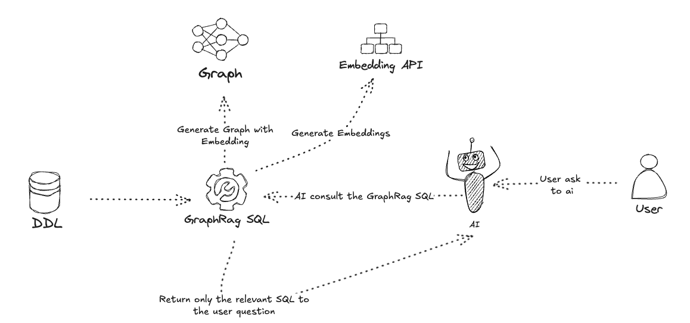

# GraphRagSQL

GraphRagSQL é uma ferramenta que converte esquemas SQL em grafos de conhecimento e utiliza RAG (Retrieval-Augmented Generation) para análise e consulta de dados. O projeto combina processamento de DDL SQL, teoria dos grafos e IA para fornecer insights sobre estruturas de banco de dados.

## 🏗️ Arquitetura



O diagrama acima ilustra o fluxo de funcionamento do GraphRagSQL:

1. O DDL SQL é fornecido como entrada
2. O GraphRagSQL processa o DDL e gera um grafo com embeddings
3. Os embeddings são gerados via API da OpenAI
4. O usuário faz perguntas em linguagem natural para a IA
5. A IA consulta o GraphRagSQL para encontrar informações relevantes
6. O sistema retorna apenas o SQL relevante para a pergunta do usuário

## 🚀 Funcionalidades

- Conversão de DDL SQL em grafos direcionados
- Geração de embeddings para análise semântica
- Sistema de logging integrado
- Suporte a análise de chaves estrangeiras e relacionamentos
- Integração com OpenAI para processamento de linguagem natural
- Exportação do grafo para visualização
- Consultas semânticas ao esquema do banco de dados

## 📋 Pré-requisitos

- Python 3.8+
- Chave de API da OpenAI
- Dependências listadas em `requirements.txt`

## 🔧 Instalação

1. Clone o repositório:
```bash
git clone https://github.com/seu-usuario/graphrag.git
cd graphrag
```

2. Crie e ative um ambiente virtual:
```bash
python -m venv venv
source venv/bin/activate  # Linux/Mac
# ou
.\venv\Scripts\activate  # Windows
```

3. Instale as dependências:
```bash
pip install -r requirements.txt
```

4. Configure as variáveis de ambiente:
```bash
cp .env.example .env
# Edite o arquivo .env e adicione sua chave da OpenAI
```

## 💻 Como usar

### 1. Análise Básica de DDL

```python
from graphrag import GraphRagSQL

# Seu DDL SQL
ddl = """
CREATE TABLE users (
    id INT PRIMARY KEY,
    name VARCHAR(255)
);

CREATE TABLE posts (
    id INT PRIMARY KEY,
    user_id INT,
    title VARCHAR(255),
    FOREIGN KEY (user_id) REFERENCES users(id)
);
"""

# Inicialize o GraphRagSQL
graph_rag = GraphRagSQL(ddl)
```

### 2. Exportar Grafo para Visualização

```python
# Exporta o grafo para um arquivo JSON que pode ser visualizado
graph_rag.export_graph_json('demo/public/graph_data.json')
```

### 3. Consultas Semânticas

```python
import asyncio

# Consulta por similaridade semântica
async def main():
    # Encontra tabelas relacionadas a usuários
    result = await graph_rag.query_graph("tabelas relacionadas a usuários")
    print(result)

    # Encontra estruturas de posts
    result = await graph_rag.query_graph("estrutura de posts e comentários")
    print(result)

asyncio.run(main())
```

### 4. Análise de Relacionamentos

```python
# Obter tabelas relacionadas a uma tabela específica
related_tables = graph_rag._get_related_tables("users")
print(f"Tabelas relacionadas a 'users': {related_tables}")

# Reconstruir DDL de uma tabela
ddl = graph_rag._reconstruct_ddl_for_node("posts")
print(f"DDL reconstruído:\n{ddl}")
```

### 5. Logging Personalizado

```python
# Inicialize com nível de log específico
graph_rag = GraphRagSQL(ddl, log_level="DEBUG")
```

## 🧪 Testes

Para rodar os testes:

```bash
python -m pytest tests/
```

## 🤝 Contribuindo

Contribuições são bem-vindas! Por favor, leia nosso guia de contribuição em [CONTRIBUTING.md](CONTRIBUTING.md) para detalhes sobre nosso código de conduta e o processo para enviar pull requests.

## 📄 Licença

Este projeto está licenciado sob a Licença MIT - veja o arquivo [LICENSE](LICENSE) para detalhes.

## 📞 Contato

Se você tiver alguma dúvida ou sugestão, por favor abra uma issue no GitHub. 